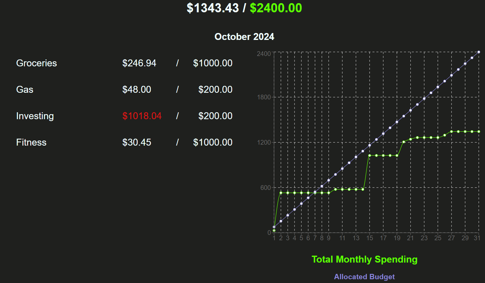
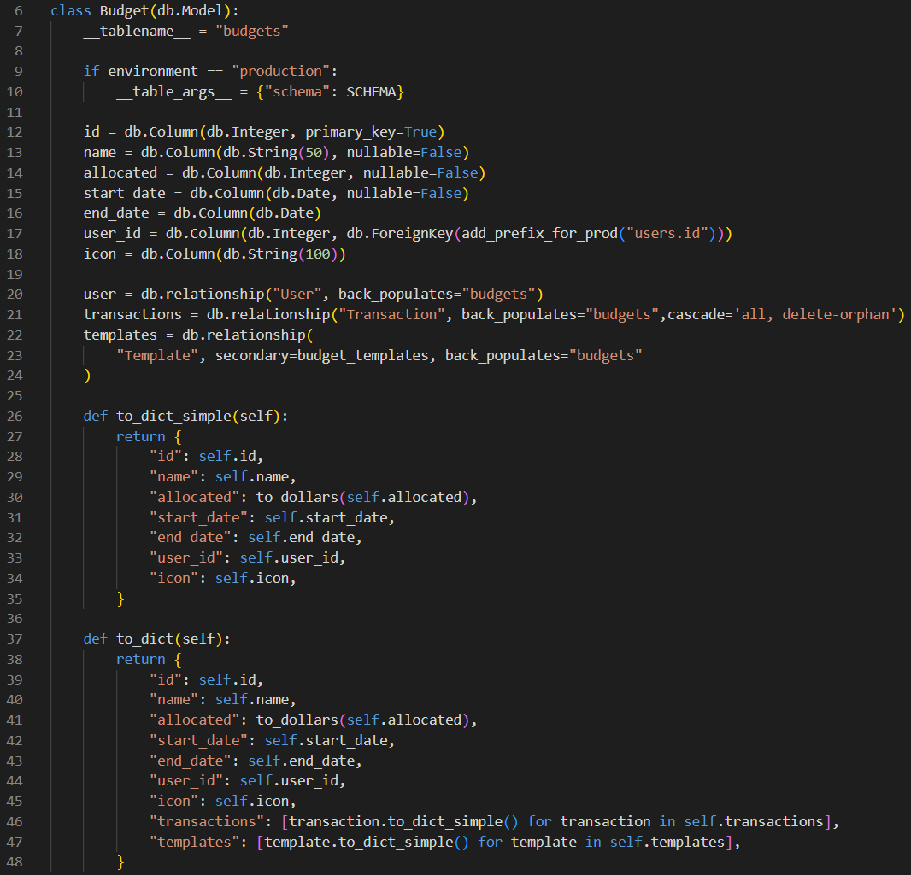

# Budget Me

**BudgetMe** is a personal finance app that lets you create monthly budgets, input transactions to track your per-budget and overall spending, share budget templates with friends and family, and track progress toward your save goals.



[> Live demo here! <](https://budget-me.onrender.com/)

## Features

### User Authentication

Sign up with a unique email and password, or log into the demo account just to get a feel for the controls.

### Budgets

Add, view, edit, and delete monthly budgets. Each budget has an allocated monthly dollar amount, a start date, and an optional end date, and will remain active in your portfolio until the end date is reached.



### Transactions

Add, view, edit, and delete transactions. Each transaction has a date and dollar amount, and is connected to a specific budget; its amount is automatically deducted from that budget for that month.

### Budget Templates

Add, view, edit, and delete budget templates. Each template is tied to one or more of your budgets, and can be shared with friends and family.

### Save Goals

Add, view, edit, and delete save goals. Each save goal has an end date, after which it becomes inactive.

## Technologies

BudgetMe's backend web API is built with [Flask](https://flask.palletsprojects.com/en/3.0.x/). It uses the [SQLAlchemy](https://www.sqlalchemy.org/) ORM, plus [Alembic](https://alembic.sqlalchemy.org/en/latest/) to handle database migrations.

Its frontend is designed with [React](https://react.dev/) and vanilla CSS. A [Redux](https://redux.js.org/) store is used for session management.

## Code Along

To run your own copy of BudgetMe:

1. Clone this repository.

2. Install dependencies.

   ```bash
   pipenv install -r requirements.txt
   ```

3. Create a **.env** file based on the example with proper settings for your
   development environment.

4. Make sure the SQLite3 database connection URL is in the **.env** file.

5. Get into your pipenv, migrate your database, seed your database, and run your
   Flask app:

   ```bash
   pipenv shell
   ```

   ```bash
   flask db upgrade
   ```

   ```bash
   flask seed all
   ```

   ```bash
   flask run
   ```

6. To run the React frontend in development, `cd` into the **react-vite**
   directory and run `npm i` to install dependencies. Next, run `npm run build`
   to create the `dist` folder. This command includes the `--watch` flag, which will rebuild the **dist**
   folder whenever you change your code.
